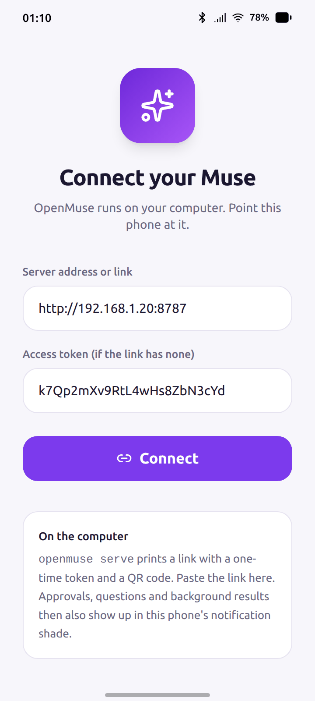
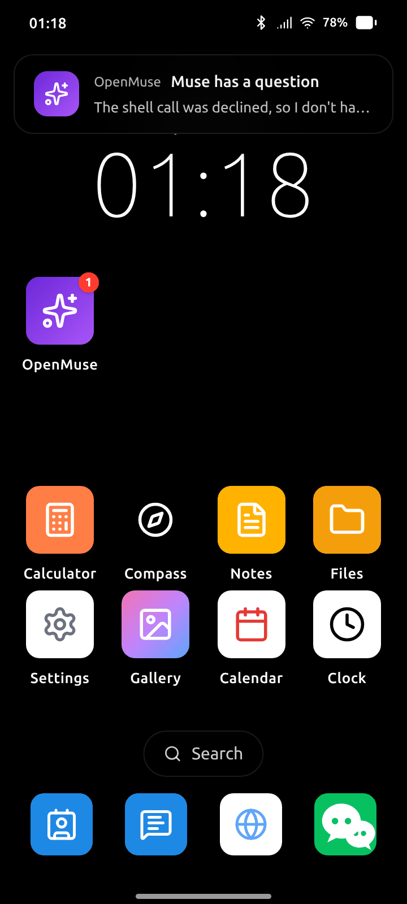
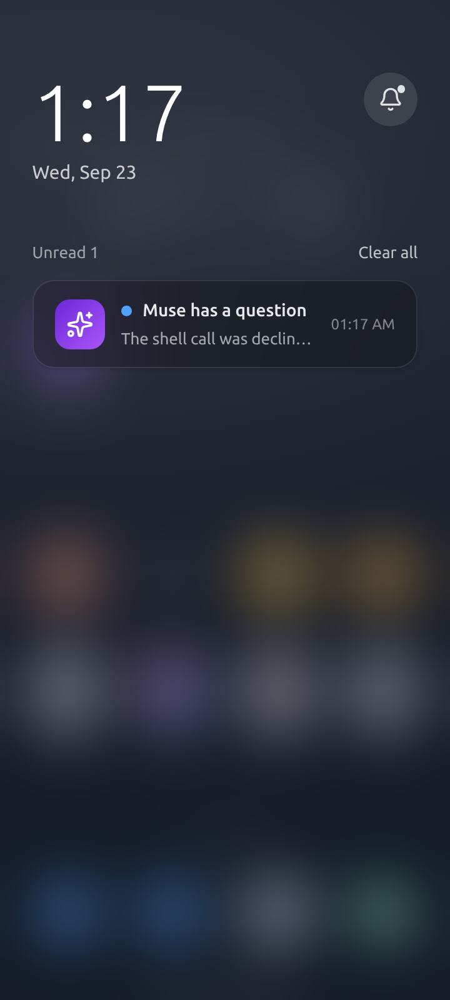
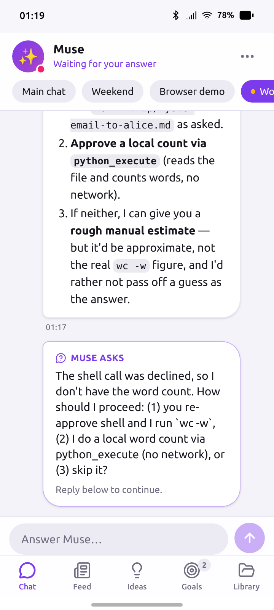

# unibot as an app on a simulated phone

Muse lives on a phone: it sits among your other apps, and when it needs you — an approval, a
question, something it finished in the background — it comes through the notification shade.
This directory makes unibot behave that way inside [MobileGym](https://github.com/Purewhiter/mobilegym),
a browser-hosted Android simulator with a launcher, a notification shade and 28 re-implemented
apps (WeChat, Alipay, 12306, …). No device, no emulator: one browser tab.

<p align="center">
  
  
  
  
</p>

`apps/unibot/` is an app module in MobileGym's own format (manifest, entry component,
navigation declaration, Zustand store — see the platform's app module contract). It is a thin
shell around the real unibot web app:

- **The app** shows the unibot web app full screen, served by `unibot serve` on your
  computer. Everything you see is the same code a real phone gets; the shell only keeps the
  tab bar clear of the simulator's gesture bar.
- **Notifications** — real phones get Web Push. The simulator has no push service, so the
  module keeps one WebSocket to the server open for the whole simulator session (the store is
  loaded at boot, before any app is opened) and turns the events a phone would be notified
  about into simulated Android notifications: *Muse needs your approval*, *Muse has a
  question*, and the last word of a background pass or check-in. Tapping one opens unibot
  on that chat. A card you decide from another device takes its notification down again; the
  launcher icon carries the unread badge.
- **Setup** — on first launch the app asks for the server address; paste the link
  `unibot serve` prints (it carries the access token). The token is checked by opening the
  server's WebSocket once, so the server needs no CORS configuration.
- **The phone as the agent's hands** — with *Let unibot operate this phone* ticked on the
  setup page (on by default), the module also announces the simulator as a *device*: it lists
  the installed apps, and answers the server's requests for the screen and for actions. The
  screen is a picture: the simulator's DOM is rendered to a 360×800 PNG in the page
  (`modern-screenshot`), with the app and route read off the simulator's OS — no element list,
  the agent taps by position like a finger would — and actions go through MobileGym's own input
  API. While Muse works, a ripple marks each tap, a line each swipe, and a caption under the
  screen says what it is doing; the marks are left out of the screenshots. Nothing is touched
  unless the server's own *Phone* switch is on too (`[gui] enabled`, or Connections → Phone in
  the app); [docs/gui.md](../../docs/gui.md) has the rest, including what asks for approval
  first.

- **The hosted showcase** — built with `VITE_UNIBOT_DEMO=/api/demo`, the setup page first
  offers a Muse on the showcase server: one tap (or none, the first time) and the *showcase
  gateway* ([`demo/showcase/`](../showcase/)) starts a private unibot for this visitor, for a
  while and within a model budget, with the option of the visitor's own model key. A normal
  checkout has the variable empty and never asks the gateway for anything.

The lighter variant needs nothing installed: open the simulator's own Browser app and go to the
link `unibot serve` prints. That is the web app as any phone browser gets it — full screen, tab
bar, approval cards — minus the notifications, which is what this module adds.

## Run it

Node 22+, Python 3.11+, a Chromium-based desktop browser. MobileGym's 1.9 GB companion
dataset is optional here: unibot does not need it, the simulated media apps just render empty
without it.

```bash
# 1. unibot, as usual — prints a link with a one-time token
unibot serve --port 8787

# 2. MobileGym with the unibot app installed
git clone --depth 1 https://github.com/Purewhiter/mobilegym.git
demo/mobilegym/install.sh mobilegym          # copies apps/unibot into the checkout
cd mobilegym && npm install && npm run dev   # http://127.0.0.1:3000
```

Open the simulator, find **unibot** in the launcher (search works too), paste the link from
step 1, *Connect*. Then go back to the home screen and give the agent something to do from
another tab or the CLI — `unibot chat`, or the web app in a normal browser tab: the phone
lights up when it needs you.

To watch it operate the phone, turn the *Phone* switch on (Connections → Phone in the web app,
or `UNIBOT_GUI_ENABLED=1` for step 1) and ask, in the chat, for something that lives in one of
the simulated apps — "打开微信，看看最新一条消息是谁发的", "用 12306 查一下明天北京到上海最早的
高铁", "给 blank. 回一句「好的，明天见」". The agent opens the app on the simulated phone, works
through its screens, and stops at the send button until you approve.

`install.sh` only copies files; MobileGym discovers apps by directory convention, nothing in the
checkout is edited. Run it again after pulling a newer unibot.

## Notes

- **Origin.** The web app runs cross-origin inside an `<iframe>` (`127.0.0.1:8787` inside
  `127.0.0.1:3000`). That is fine for using it; it only means the outer page cannot script the
  inner one, which is the point of an iframe.
- **Dark mode.** The web app inside the frame follows the browser's colour scheme (it cannot
  see the simulator's); the setup page follows the simulator's.
- **Deep links.** The OS hands the app `/?thread=<id>`; the shell forwards `thread` and `tab`
  to the web app's own deep links (`docs/app.md`).
- **Not a MobileGym benchmark task.** The module declares its UI states and transitions like
  every MobileGym app, so the platform's analyzer sees it, but unibot's content is live
  server output and is not deterministic — it is here to show the product, not to be graded.

## Layout

```
apps/unibot/
├── manifest.ts               id, names, icon, theme, splash
├── UnibotApp.tsx           entry: router, theme vars, back handling, deep links
├── navigation.declaration.ts routes (/ and /setup), transitions, UI states
├── navigation.ts             go()/back() over the declaration
├── navigation.types.ts       re-exports the platform's shared types
├── state.ts                  Zustand store: server URL, token, notify and GUI switches, showcase session; wires the bridge
├── bridge.ts                 WebSocket → NotificationService; device announce, screen/act requests
├── demo.ts                   the showcase gateway's API (start/end a hosted session), used on the public site
├── gui.ts                    the simulator as a device: DOM → PNG screenshot, actions → __SIM_INPUT__, the finger overlay
├── pages/MusePage.tsx        the web app, full screen
├── pages/SetupPage.tsx       hosted Muse (showcase), or server address + token; the operate-this-phone switch
├── hooks/useUnibotGestures.ts
├── data/                     defaults
├── res/icons.tsx             the shell's icons; the launcher icon is the red panda
└── res/mark.tsx              the red panda's head, generated by web/scripts/mascot-assets.mjs
```
